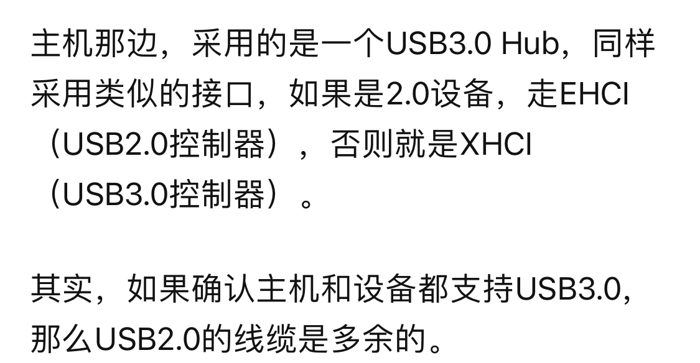

# Cube Robot

方案来源——北京科技大学 于宪元、刘磊、许仕杰

复刻效果：

[video.mp4](3.docs/md/video.mp4)

# USB Camera

[C#通过Aforge调用电脑摄像头（附代码）_泰勒Peano的博客-CSDN博客_aforge调用摄像头](https://blog.csdn.net/weixin_44996090/article/details/108402374)

工具：Visual Studio, Aforge, USB2.0摄像头, C#(Windows窗体应用，.NET Framework)

基本过程：

1. C#项目右键打开NuGet程序包管理器搜索安装这几个，就会在解决方案的项目的引用中看见他们。
    
    
    
2. 摄像头画面的工具控件是VedioSourcePlayer
3. coding

四个摄像头连接电脑

1. 一个2.0 一个3.0 不卡
2. 四个2.0接3.0hub
    
    [USB3.0HUB挂多个USB2.0设备同时操作，USB3.0一侧的速度可以是多个USB2.0的总和吗？ - USB技术论坛 - 21ic电子技术开发论坛](https://bbs.21ic.com/icview-1074514-1-1.html)
    
    会被限制在USB 2.0的速度。不过有一款产品集成了SuperTT技术的USB 3.0Hub可以实现你想要的效果。EverPro的U3H01AR
    
    
    
    [1 (comocloud.net)](https://laserchina.www.comocloud.net/upload/attachment/2020/01/14/202001140957349958.pdf)
    
    MTT 和 STT
    
    [https://www.eet-china.com/mp/a6514.html](https://www.eet-china.com/mp/a6514.html)
    
3. 解决方案 SuperTT产品链接
    
    [32位USB3.0超高速接口MCU CH569 - 南京沁恒微电子股份有限公司](http://www.wch.cn/products/CH569.html)
    

文档说明：

software中第一代代码是北科原始代码，第二代代码修改摄像头为数字摄像头，集成界面UI，修改结构。